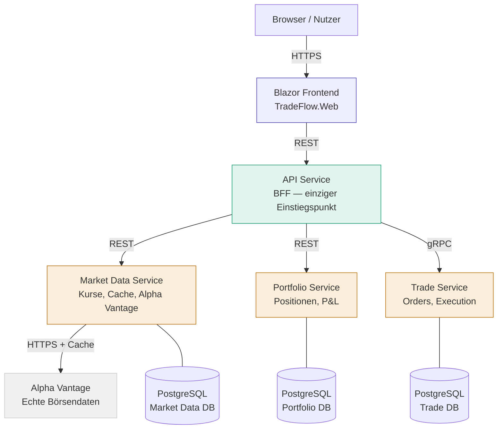
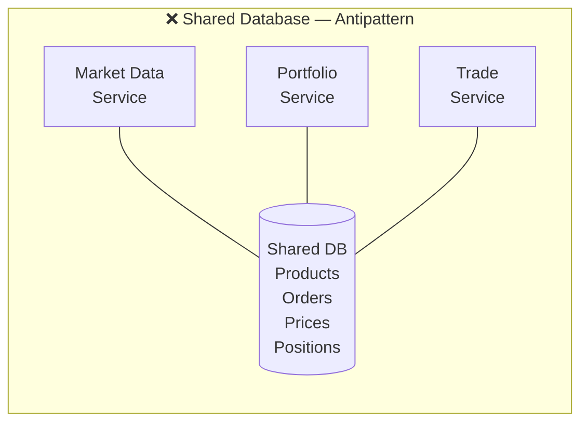
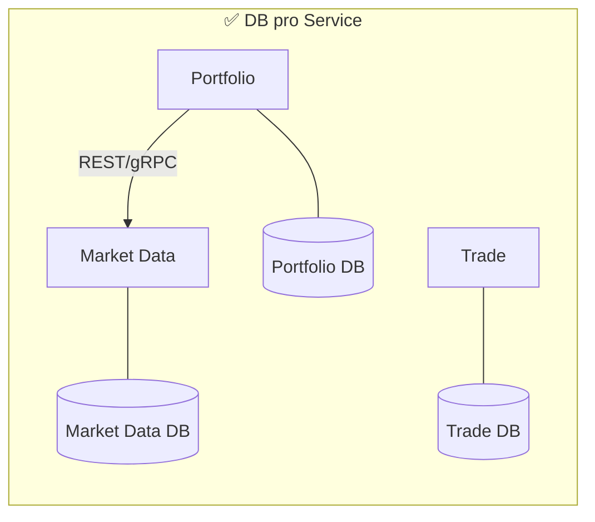
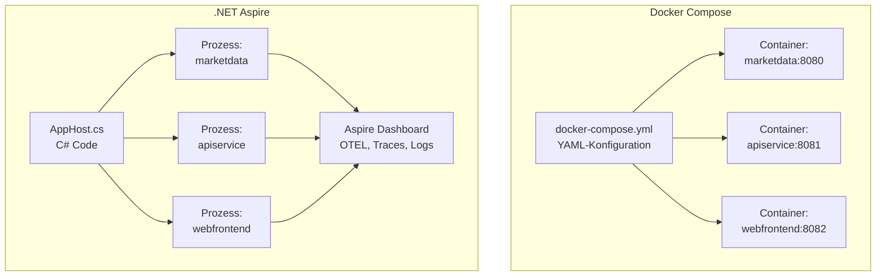
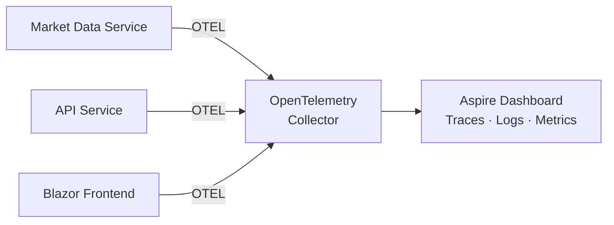
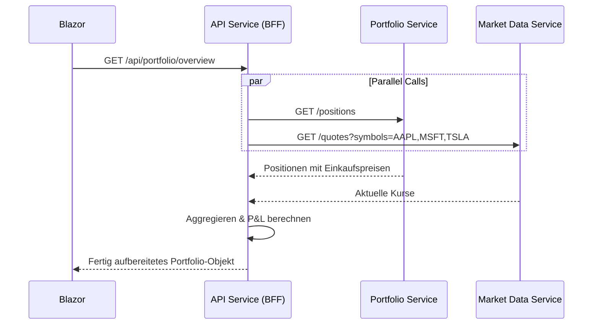
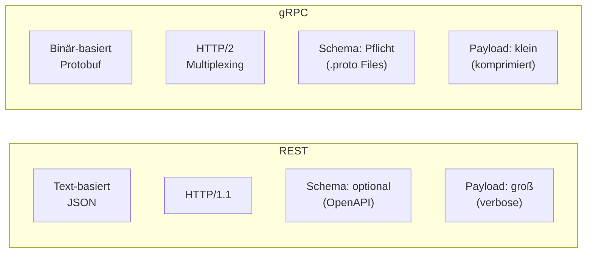
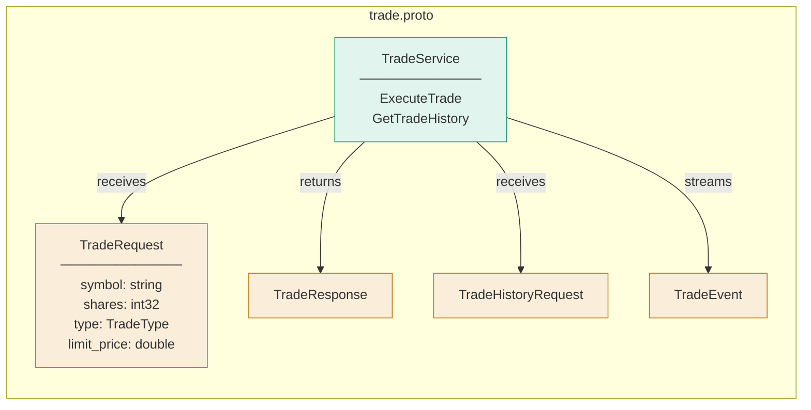
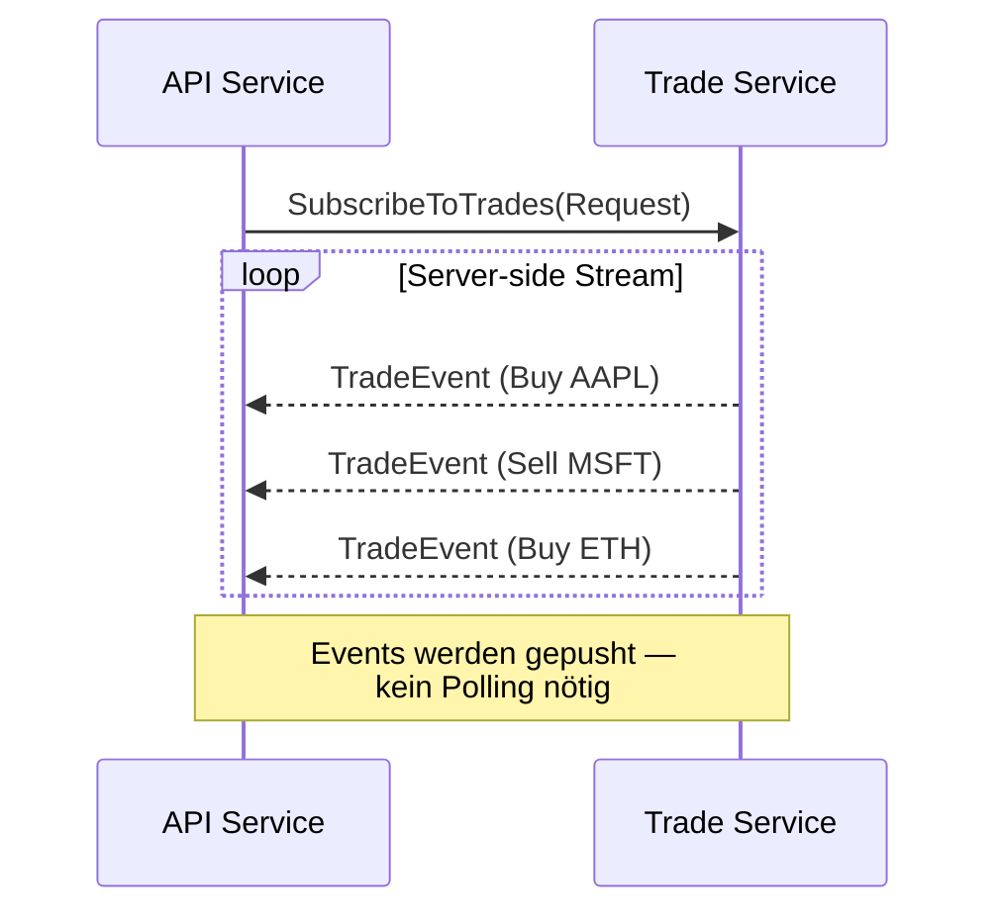
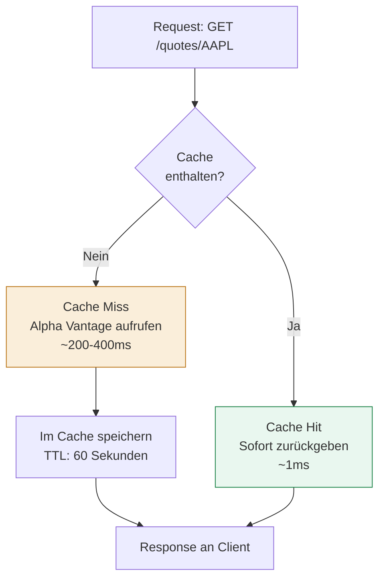

**Teil 1 einer Tutorial-Reihe** — Ich baue gerade TradeFlow, einen Portfolio- und Trade-Tracker für Aktien und Crypto auf Basis von .NET Aspire und echten Börsendaten. Das Projekt läuft parallel und ich dokumentiere hier meine Architekturentscheidungen und Learnings.

In diesem ersten Teil geht es nicht darum **was** ich gebaut habe, sondern **warum** ich es so gebaut habe. Jede Architekturentscheidung hat einen Grund — dieser Post erklärt die Gründe.

Der Stack: .NET 10, ASP.NET Core Minimal APIs, Blazor Server, .NET Aspire, Alpha Vantage API. Der Code ist auf [GitHub](https://github.com/Tim0xc0de/TradeFlow).

---

## Die Gesamtarchitektur

Bevor wir in die einzelnen Entscheidungen gehen, hier der Überblick:



Drei Services, drei Datenbanken, ein Frontend, ein API-Gateway. Das klingt nach Overhead — und ist es bewusst.

---

## Entscheidung 1: Datenbank pro Service

Das ist die fundamentalste Entscheidung in der Microservices-Architektur und gleichzeitig die die am häufigsten falsch gemacht wird. Die Frage ist: Warum nicht eine zentrale Datenbank die alle Services teilen?

Die Antwort liegt im Konzept der **Service Boundary**. Ein Microservice ist nicht primär eine technische Einheit — er ist eine fachliche Einheit mit klarer Ownership. Der Market Data Service besitzt Kursdaten. Der Portfolio Service besitzt Positionen. Der Trade Service besitzt Orders.

Wenn alle Services auf dieselbe Datenbank zugreifen, ist diese Ownership sofort gebrochen:



Das konkrete Problem: Der Portfolio Service liest direkt aus der `prices`-Tabelle des Market Data Service. Das Market Data Team entscheidet sich, Kurse nicht mehr als Dezimalzahl zu speichern sondern als Integer in Cent — weil das präziser ist und Floating-Point-Probleme vermeidet. Eine interne Optimierung, vollkommen legitim.

Der Portfolio Service crasht. Er hat eine implizite Abhängigkeit auf ein Implementierungsdetail das nie als öffentliche API gedacht war.

Mit einer Datenbank pro Service existiert dieses Problem strukturell nicht:



Der Portfolio Service fragt Kurse über eine definierte API ab. Der Market Data Service kann sein internes Schema beliebig ändern — solange die API-Contracts stabil bleiben, ist kein anderer Service betroffen. Das ist **Encapsulation auf Service-Ebene**.

Es gibt einen wichtigen Nebeneffekt: Die Datenbanken können unterschiedliche Technologien sein. Market Data könnte von einem Time-Series-Store profitieren. Portfolio braucht ACID-Transaktionen. Trade könnte Event Sourcing verwenden. Mit einer geteilten Datenbank ist man an eine Technologie gebunden. Mit separaten Datenbanken kann jedes Team das richtige Tool für das jeweilige Problem wählen.

Für TradeFlow habe ich vorerst PostgreSQL für alle drei Services gewählt — die Flexibilität ist aber architektonisch vorhanden.

---

## Entscheidung 2: .NET Aspire statt Docker Compose

Die naheliegende Alternative für lokale Microservices-Orchestrierung ist Docker Compose. Warum dann Aspire?

Docker Compose löst das Problem der Container-Orchestrierung. Aspire löst ein anderes Problem: **Developer Experience in der Entwicklungsphase**.

Der strukturelle Unterschied:



Der entscheidende Unterschied ist nicht die YAML-vs-C#-Syntax. Es ist das **Service Discovery Model**.

Mit Docker Compose definiere ich Environment Variables manuell:

```yaml
services:
  apiservice:
    environment:
      - MARKETDATA_URL=http://marketdata:8080
  marketdata:
    ports:
      - "8080:8080"
```

Mit Aspire passiert das automatisch:

```csharp
var marketData = builder.AddProject<Projects.TradeFlow_MarketDataService>("marketdata")
    .WithHttpHealthCheck("/health");

var apiService = builder.AddProject<Projects.TradeFlow_ApiService>("apiservice")
    .WithReference(marketData)  // Aspire injiziert die URL automatisch
    .WaitFor(marketData);
```

Das `.WithReference(marketData)` injiziert die korrekte URL als Umgebungsvariable in den API Service — sowohl lokal als auch in der Cloud, ohne eine einzige Code-Änderung. Die Services referenzieren sich per Name, nicht per hardcoded URL.

Dazu kommt das Aspire Dashboard — ein eingebautes Observability-Tool das alle OpenTelemetry-Daten aller Services in einer UI aggregiert. Distributed Tracing, strukturierte Logs, Health Checks, Metrics — ohne zusätzliche Infrastruktur.



In einem Distributed-System ohne Tracing ist Debugging ein Ratespiel. Ein Request geht durch drei Services — in welchem ist die Latenz? Welcher Service hat den Fehler ausgelöst? Das Aspire Dashboard beantwortet das mit einem Klick.

Docker Compose ist die richtige Wahl für Produktions-Deployments mit Container-Isolation. Aspire ist die richtige Wahl für die Entwicklungsphase mit maximaler Developer Experience. Beides schließt sich nicht aus — TradeFlow kann mit Aspire entwickelt und mit Docker Compose deployed werden.

---

## Entscheidung 3: BFF Pattern (Backend for Frontend)

TradeFlow hat einen dedizierten API Service der zwischen dem Blazor Frontend und den internen Services sitzt. Das ist kein API-Gateway im klassischen Sinne — es ist ein **Backend for Frontend**.

Das BFF Pattern löst ein spezifisches Problem: Frontends haben andere Datenbedürfnisse als Backend-Services.

Betrachte die Portfolio-Übersicht. Was das Frontend braucht:

```json
{
  "totalValue": 15234.50,
  "dayChange": -234.20,
  "dayChangePercent": -1.51,
  "positions": [
    {
      "symbol": "AAPL",
      "shares": 10,
      "currentPrice": 255.76,
      "currentValue": 2557.60,
      "gainLoss": -50.40,
      "gainLossPercent": -1.93
    }
  ]
}
```

Was die internen Services liefern:

- **Portfolio Service**: `{ positions: [{ symbol: "AAPL", shares: 10, avgBuyPrice: 261.04 }] }`
- **Market Data Service**: `{ symbol: "AAPL", price: 255.76, changePercent: -1.94 }`

Das Frontend bräuchte ohne BFF zwei parallele Calls machen, die Daten joinen und die Berechnungen selbst durchführen. Mit BFF:



Der BFF macht die parallelen Calls intern, aggregiert die Daten, führt die Berechnungen durch und gibt dem Frontend ein einziges, fertig aufbereitetes Objekt zurück. Das Frontend macht einen Call und bekommt alles was es braucht.

Das hat mehrere Konsequenzen:

**Reduced Chattiness**: Ein Blazor-Request statt zwei. Bei schlechter Netzwerkverbindung halbiert sich die Latenz.

**Loose Coupling**: Das Frontend kennt keine interne Service-Topologie. Wenn ich den Portfolio Service in zwei Services aufteile, ändert sich nichts am Frontend — nur der BFF muss angepasst werden.

**Aggregation-Logik gehört ins Backend**: Die Berechnung von P&L ist Business-Logik, keine UI-Logik. Sie sollte testbar, versionierbar und serverseitig ausgeführt werden.

Das BFF ist kein Antipattern — es ist ein Pattern das genau für diesen Anwendungsfall designed wurde. Der Trade-off: ein weiterer Service, ein weiterer Deployment-Schritt. Der Gewinn: eine saubere Trennung zwischen Frontend-Anforderungen und Backend-Capabilities.

---

## Entscheidung 4: gRPC für interne Service-Kommunikation

Der Trade Service kommuniziert mit dem API Service über gRPC statt REST. Warum?

REST und gRPC lösen dasselbe Problem — Service-zu-Service-Kommunikation — aber mit unterschiedlichen Trade-offs:



Für externe APIs — also alles was ein Browser oder ein Drittanbieter aufruft — ist REST die richtige Wahl. Es ist universell, debuggbar, und jeder Client spricht es.

Für interne Service-zu-Service-Kommunikation mit hohem Durchsatz hat gRPC strukturelle Vorteile:

**Protobuf als Contract-First Schema**: Das `.proto`-File definiert den Vertrag zwischen Services. Beide Seiten generieren Code daraus — kein manuelles JSON-Mapping, keine Schema-Drift.



Wenn der Trade Service seine API ändert, schlägt die Protobuf-Kompilierung fehl — nicht erst zur Laufzeit wenn ein Request schief geht. Das ist ein erheblicher Unterschied zu REST wo Schema-Inkompatibilitäten oft erst in Produktion auffallen.

**HTTP/2 Multiplexing**: gRPC läuft über HTTP/2 das mehrere Requests über eine einzige TCP-Verbindung multiplext. Bei häufigen kleinen Calls — wie dem Abrufen von Kursen für 20 Portfolio-Positionen — reduziert das den Connection-Overhead erheblich.

**Streaming**: gRPC unterstützt bidirektionales Streaming nativ. Der Trade Service kann dem API Service Trade-Events pushen sobald sie auftreten — ohne Polling, ohne WebSocket-Overhead.



Der Trade-off: gRPC ist nicht direkt im Browser nutzbar und schwieriger zu debuggen als REST (kein curl). Deshalb exponiert der API Service REST-Endpoints nach außen und übersetzt intern auf gRPC. Die Komplexität bleibt im Backend.

---

## Entscheidung 5: Cache-aside Pattern im Market Data Service

Der Market Data Service cached alle Kursdaten im Memory. Die Entscheidung wie gecached wird — nicht ob — ist eine Architekturentscheidung.

Es gibt mehrere Caching-Strategien. Ich habe **Cache-aside** (auch Lazy Loading genannt) gewählt:



Die Alternative wäre **Write-through** (Cache wird beim Schreiben befüllt) oder **Refresh-ahead** (Cache wird proaktiv refresht bevor er abläuft). Für einen Read-heavy Service der externe Daten aggregiert ist Cache-aside die richtige Wahl:

- Der Cache wird nur für tatsächlich angefragte Symbole befüllt — kein Prefetching von Daten die niemand braucht
- Der Code bleibt einfach und nachvollziehbar
- Cache-Invalidierung ist trivial: TTL läuft ab, nächster Request holt frische Daten

Die TTL ist eine bewusste Business-Entscheidung, keine technische:

| Use Case | TTL | Begründung |
|---|---|---|
| Aktueller Kurs | 60 Sekunden | Portfolio-Dashboard braucht keine Echtzeit-Daten |
| Tageshistorie | 5 Minuten | Ändert sich tagsüber, aber nicht sekündlich |
| Multi-Monats-Historie | 15 Minuten | Historische Daten sind sehr stabil |

Ein Intraday-Trading-Tool würde 5-Sekunden-TTLs oder gar kein Caching brauchen. Ein Portfolio-Dashboard das man einmal täglich checkt kann mit 60 Sekunden gut leben. Das ist **Eventual Consistency als bewusste Entscheidung** — nicht als Kompromiss.

Der praktische Effekt: Bei 25 API-Calls pro Tag Limit bei Alpha Vantage Free Tier und 60-Sekunden-Cache kann TradeFlow theoretisch 25 × 60 = 1500 Requests pro Tag pro Symbol bedienen ohne das Limit zu erreichen.

---

## Die Implementierung: Typed HttpClient Pattern

Ein Detail das ich bewusst so entschieden habe: der `AlphaVantageService` verwendet das **Typed HttpClient Pattern** statt einen HttpClient direkt zu instanziieren.

```csharp
// Program.cs
builder.Services.AddHttpClient<AlphaVantageService>();

// AlphaVantageService.cs
public class AlphaVantageService(HttpClient httpClient, IConfiguration config)
{
    private readonly string _apiKey = config["AlphaVantage:ApiKey"]!;
    
    public async Task<StockQuote?> GetQuoteAsync(string symbol)
    {
        // httpClient wird vom Framework verwaltet
    }
}
```

Der Grund: `HttpClient` direkt instanziieren (`new HttpClient()`) führt zu **Socket Exhaustion**. HttpClient hält TCP-Verbindungen nach dem Dispose noch offen — das ist ein bekanntes .NET-Problem. `IHttpClientFactory` managed einen Connection Pool und löst das Problem transparent.

Das Typed Client Pattern ist die empfohlene Variante weil es den HttpClient fest an einen Service bindet, Dependency Injection nutzt, und den Code testbar macht — der HttpClient kann in Tests einfach gemockt werden.

---

## API Key Management mit User Secrets

Der Alpha Vantage API-Key wird nicht im Code gespeichert — nicht in appsettings.json, nicht in einer Konfigurationsdatei die in Git landet. Er wird mit .NET User Secrets verwaltet:

```bash
dotnet user-secrets init --project TradeFlow.MarketDataService
dotnet user-secrets set "AlphaVantage:ApiKey" "DEIN_KEY" --project TradeFlow.MarketDataService
```

User Secrets speichern den Key in einem benutzerspezifischen Ordner außerhalb des Projekt-Verzeichnisses — unter Windows `%APPDATA%\Microsoft\UserSecrets`. Der Key landet nie in Git, egal wie unvorsichtig man beim Commiten ist.

In Produktion würde das durch Azure Key Vault oder Kubernetes Secrets ersetzt — aber das Prinzip ist dasselbe: Secrets gehören nicht in den Code.

---

## Was kommt als nächstes

TradeFlow ist noch nicht fertig. Die nächsten Architekturentscheidungen die ich dokumentieren werde:

**RabbitMQ für Event-driven Communication**: Wenn ein Trade ausgeführt wird, muss der Portfolio Service seine Positionen aktualisieren und der Notification Service eine Benachrichtigung schicken. Das über synchrone REST-Calls zu lösen würde den Trade Service von beiden abhängig machen. Stattdessen publiziert der Trade Service ein `TradeExecuted` Event auf RabbitMQ — und jeder Service der sich dafür interessiert, subscribt darauf.

**Entity Framework Core mit Migrations**: Jeder Service bekommt seinen eigenen DbContext und seine eigene Migration-History. Schema-Änderungen sind Service-intern und können unabhängig deployed werden.

**Blazor Charts mit echten OHLCV-Daten**: Die Kursverlauf-Daten sind bereits im Market Data Service — der nächste Schritt ist ein Candlestick-Chart im Frontend.

---

Der Code ist auf GitHub: [github.com/Tim0xc0de/TradeFlow](https://github.com/Tim0xc0de/TradeFlow)

---

*Tim Mehmeti — Softwareentwickler. Schreibt über .NET, verteilte Systeme und Architekturentscheidungen.*
