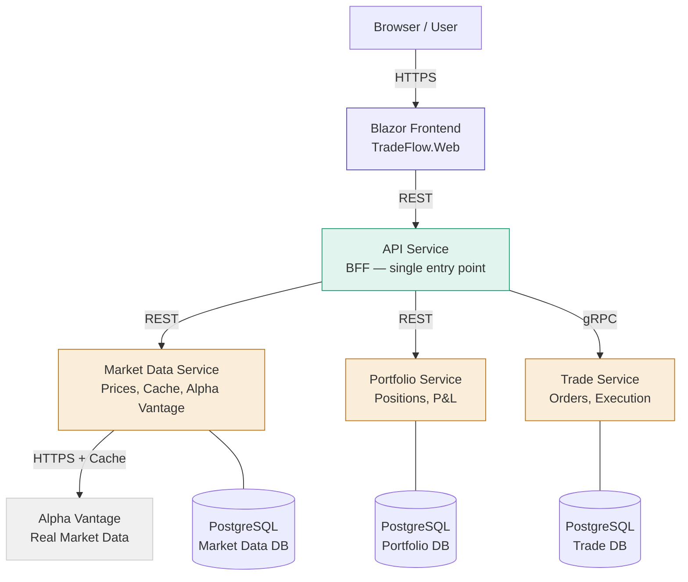
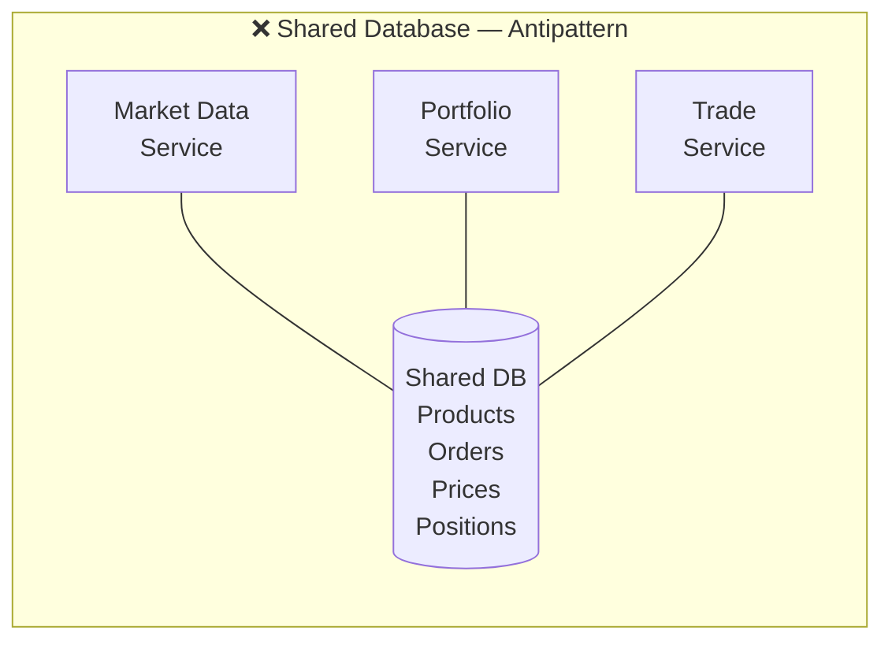
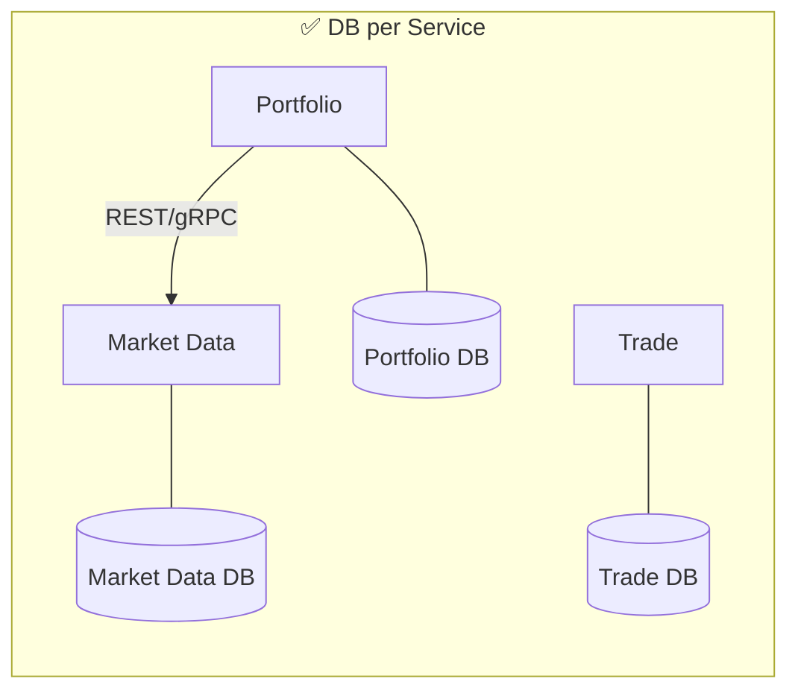
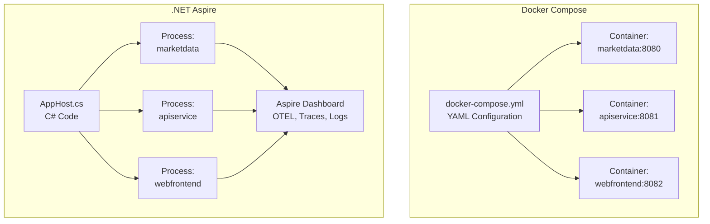
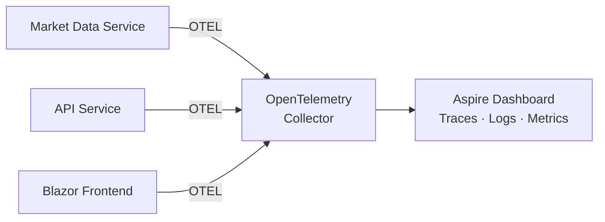
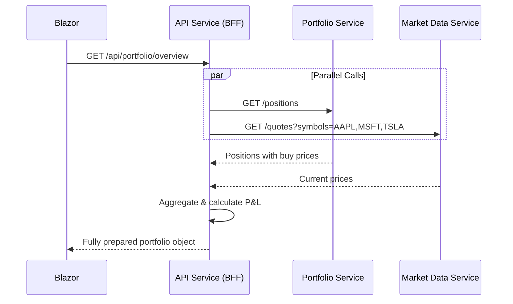
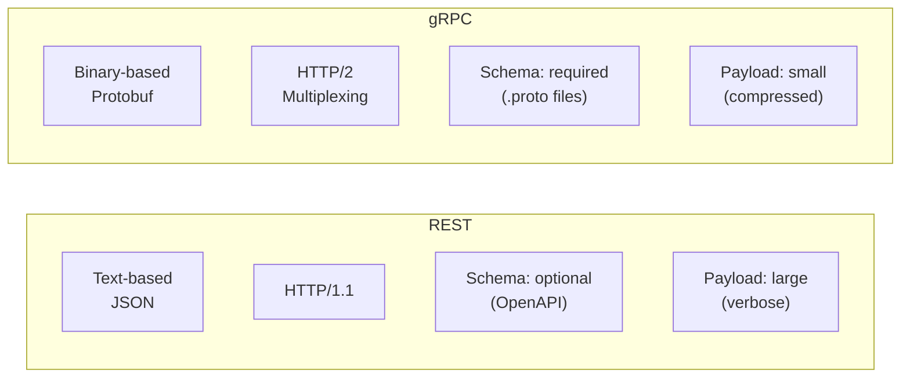
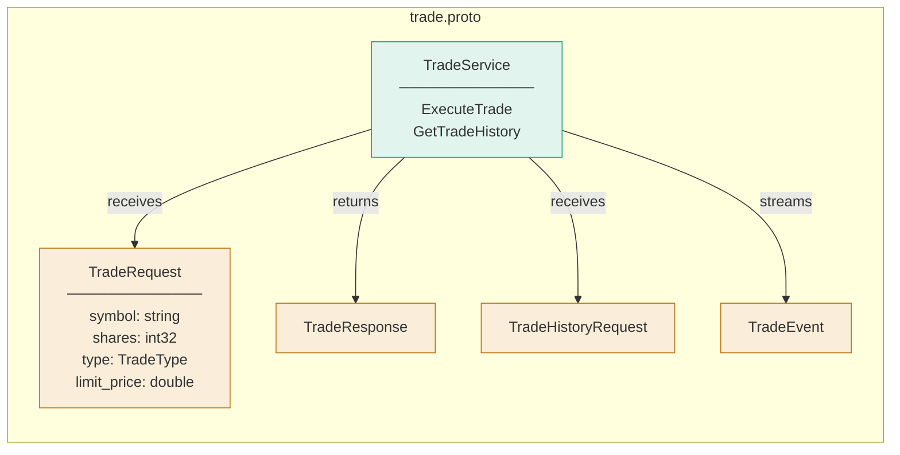
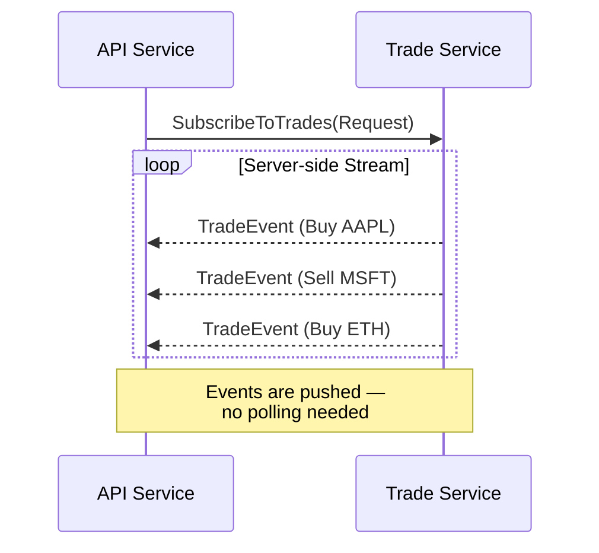
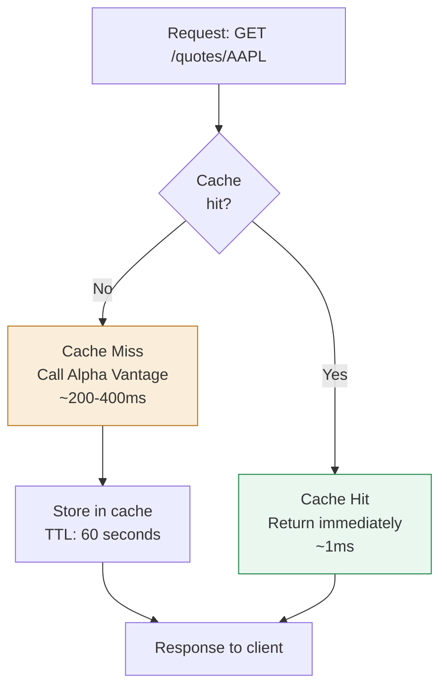

**Part 1 of a tutorial series** — I'm currently building TradeFlow, a portfolio and trade tracker for stocks and crypto based on .NET Aspire and real market data. The project is ongoing and I'm documenting my architecture decisions and learnings here.

In this first part, it's not about **what** I built, but **why** I built it the way I did. Every architecture decision has a reason — this post explains those reasons.

The stack: .NET 10, ASP.NET Core Minimal APIs, Blazor Server, .NET Aspire, Alpha Vantage API. The code is on [GitHub](https://github.com/Tim0xc0de/TradeFlow).

---

## The Overall Architecture

Before we dive into individual decisions, here's the overview:



Three services, three databases, one frontend, one API gateway. Sounds like overhead — and it is, deliberately.

---

## Decision 1: Database per Service

This is the most fundamental decision in microservices architecture and simultaneously the one most often done wrong. The question is: Why not a single shared database?

The answer lies in the concept of **Service Boundary**. A microservice is not primarily a technical unit — it's a business unit with clear ownership. The Market Data Service owns price data. The Portfolio Service owns positions. The Trade Service owns orders.

When all services access the same database, this ownership is immediately broken:



The concrete problem: The Portfolio Service reads directly from the Market Data Service's `prices` table. The Market Data team decides to store prices as integers in cents instead of decimals — because it's more precise and avoids floating-point issues. A purely internal optimization, completely legitimate.

The Portfolio Service crashes. It had an implicit dependency on an implementation detail that was never intended as a public API.

With a database per service, this problem structurally doesn't exist:



The Portfolio Service queries prices through a defined API. The Market Data Service can change its internal schema freely — as long as the API contracts remain stable, no other service is affected. That's **encapsulation at the service level**.

There's an important side effect: The databases can use different technologies. Market Data could benefit from a time-series store. Portfolio needs ACID transactions. Trade could use event sourcing. With a shared database, you're locked into one technology. With separate databases, each team can choose the right tool for the problem at hand.

For TradeFlow, I chose PostgreSQL for all three services for now — but the architectural flexibility is there.

---

## Decision 2: .NET Aspire Instead of Docker Compose

The obvious alternative for local microservices orchestration is Docker Compose. So why Aspire?

Docker Compose solves the problem of container orchestration. Aspire solves a different problem: **Developer Experience during the development phase**.

The structural difference:



The key difference isn't the YAML-vs-C# syntax. It's the **Service Discovery Model**.

With Docker Compose, I define environment variables manually:

```yaml
services:
  apiservice:
    environment:
      - MARKETDATA_URL=http://marketdata:8080
  marketdata:
    ports:
      - "8080:8080"
```

With Aspire, it happens automatically:

```csharp
var marketData = builder.AddProject<Projects.TradeFlow_MarketDataService>("marketdata")
    .WithHttpHealthCheck("/health");

var apiService = builder.AddProject<Projects.TradeFlow_ApiService>("apiservice")
    .WithReference(marketData)  // Aspire injects the URL automatically
    .WaitFor(marketData);
```

The `.WithReference(marketData)` injects the correct URL as an environment variable into the API Service — both locally and in the cloud, without a single code change. Services reference each other by name, not by hardcoded URL.

On top of that comes the Aspire Dashboard — a built-in observability tool that aggregates all OpenTelemetry data from all services in a single UI. Distributed tracing, structured logs, health checks, metrics — without additional infrastructure.



In a distributed system without tracing, debugging is guesswork. A request passes through three services — where's the latency? Which service caused the error? The Aspire Dashboard answers that with a single click.

Docker Compose is the right choice for production deployments with container isolation. Aspire is the right choice for the development phase with maximum developer experience. They're not mutually exclusive — TradeFlow can be developed with Aspire and deployed with Docker Compose.

---

## Decision 3: BFF Pattern (Backend for Frontend)

TradeFlow has a dedicated API Service sitting between the Blazor frontend and the internal services. This isn't an API gateway in the traditional sense — it's a **Backend for Frontend**.

The BFF pattern solves a specific problem: Frontends have different data needs than backend services.

Consider the portfolio overview. What the frontend needs:

```json
{
  "totalValue": 15234.50,
  "dayChange": -234.20,
  "dayChangePercent": -1.51,
  "positions": [
    {
      "symbol": "AAPL",
      "shares": 10,
      "currentPrice": 255.76,
      "currentValue": 2557.60,
      "gainLoss": -50.40,
      "gainLossPercent": -1.93
    }
  ]
}
```

What the internal services deliver:

- **Portfolio Service**: `{ positions: [{ symbol: "AAPL", shares: 10, avgBuyPrice: 261.04 }] }`
- **Market Data Service**: `{ symbol: "AAPL", price: 255.76, changePercent: -1.94 }`

Without the BFF, the frontend would need to make two parallel calls, join the data, and perform the calculations itself. With the BFF:



The BFF makes the parallel calls internally, aggregates the data, performs the calculations, and returns a single, fully prepared object to the frontend. One call, everything included.

This has several consequences:

**Reduced Chattiness**: One Blazor request instead of two. On poor network connections, latency is cut in half.

**Loose Coupling**: The frontend knows nothing about internal service topology. If I split the Portfolio Service into two services, nothing changes for the frontend — only the BFF needs adjustment.

**Aggregation logic belongs in the backend**: P&L calculation is business logic, not UI logic. It should be testable, versionable, and executed server-side.

The BFF is not an antipattern — it's a pattern designed exactly for this use case. The trade-off: one more service, one more deployment step. The gain: a clean separation between frontend requirements and backend capabilities.

---

## Decision 4: gRPC for Internal Service Communication

The Trade Service communicates with the API Service via gRPC instead of REST. Why?

REST and gRPC solve the same problem — service-to-service communication — but with different trade-offs:



For external APIs — anything a browser or third party calls — REST is the right choice. It's universal, debuggable, and every client speaks it.

For internal service-to-service communication with high throughput, gRPC has structural advantages:

**Protobuf as Contract-First Schema**: The `.proto` file defines the contract between services. Both sides generate code from it — no manual JSON mapping, no schema drift.



When the Trade Service changes its API, the Protobuf compilation fails — not at runtime when a request goes wrong. That's a significant difference from REST where schema incompatibilities often only surface in production.

**HTTP/2 Multiplexing**: gRPC runs over HTTP/2, which multiplexes multiple requests over a single TCP connection. For frequent small calls — like fetching prices for 20 portfolio positions — this significantly reduces connection overhead.

**Streaming**: gRPC natively supports bidirectional streaming. The Trade Service can push trade events to the API Service as they occur — no polling, no WebSocket overhead.



The trade-off: gRPC isn't directly usable in the browser and is harder to debug than REST (no curl). That's why the API Service exposes REST endpoints externally and translates to gRPC internally. The complexity stays in the backend.

---

## Decision 5: Cache-aside Pattern in the Market Data Service

The Market Data Service caches all price data in memory. The decision of how to cache — not whether to — is an architecture decision.

There are several caching strategies. I chose **Cache-aside** (also called Lazy Loading):



The alternative would be **Write-through** (cache is populated on write) or **Refresh-ahead** (cache is proactively refreshed before expiry). For a read-heavy service that aggregates external data, cache-aside is the right choice:

- The cache is only populated for actually requested symbols — no prefetching of data nobody needs
- The code stays simple and understandable
- Cache invalidation is trivial: TTL expires, next request fetches fresh data

The TTL is a deliberate business decision, not a technical one:

| Use Case | TTL | Reasoning |
|---|---|---|
| Current price | 60 seconds | Portfolio dashboard doesn't need real-time data |
| Daily history | 5 minutes | Changes during the day, but not every second |
| Multi-month history | 15 minutes | Historical data is very stable |

An intraday trading tool would need 5-second TTLs or no caching at all. A portfolio dashboard checked once daily can live with 60 seconds. This is **eventual consistency as a deliberate decision** — not a compromise.

The practical effect: With Alpha Vantage Free Tier's 25 API calls per day limit and a 60-second cache, TradeFlow can theoretically serve 25 × 60 = 1,500 requests per day per symbol without hitting the limit.

---

## The Implementation: Typed HttpClient Pattern

A detail I deliberately chose: the `AlphaVantageService` uses the **Typed HttpClient Pattern** instead of directly instantiating an HttpClient.

```csharp
// Program.cs
builder.Services.AddHttpClient<AlphaVantageService>();

// AlphaVantageService.cs
public class AlphaVantageService(HttpClient httpClient, IConfiguration config)
{
    private readonly string _apiKey = config["AlphaVantage:ApiKey"]!;
    
    public async Task<StockQuote?> GetQuoteAsync(string symbol)
    {
        // httpClient is managed by the framework
    }
}
```

The reason: Directly instantiating `HttpClient` (`new HttpClient()`) leads to **Socket Exhaustion**. HttpClient keeps TCP connections open after disposal — this is a known .NET issue. `IHttpClientFactory` manages a connection pool and solves the problem transparently.

The Typed Client Pattern is the recommended approach because it binds the HttpClient to a specific service, uses Dependency Injection, and makes the code testable — the HttpClient can easily be mocked in tests.

---

## API Key Management with User Secrets

The Alpha Vantage API key is not stored in code — not in appsettings.json, not in a configuration file that ends up in Git. It's managed with .NET User Secrets:

```bash
dotnet user-secrets init --project TradeFlow.MarketDataService
dotnet user-secrets set "AlphaVantage:ApiKey" "YOUR_KEY" --project TradeFlow.MarketDataService
```

User Secrets store the key in a user-specific folder outside the project directory — on Windows `%APPDATA%\Microsoft\UserSecrets`. The key never ends up in Git, no matter how careless you are when committing.

In production, this would be replaced by Azure Key Vault or Kubernetes Secrets — but the principle is the same: secrets don't belong in code.

---

## What's Next

TradeFlow isn't finished yet. The next architecture decisions I'll document:

**RabbitMQ for Event-driven Communication**: When a trade is executed, the Portfolio Service needs to update its positions and the Notification Service needs to send a notification. Solving this via synchronous REST calls would make the Trade Service dependent on both. Instead, the Trade Service publishes a `TradeExecuted` event to RabbitMQ — and every service that cares subscribes to it.

**Entity Framework Core with Migrations**: Each service gets its own DbContext and its own migration history. Schema changes are service-internal and can be deployed independently.

**Blazor Charts with Real OHLCV Data**: The price history data is already in the Market Data Service — the next step is a candlestick chart in the frontend.

---

The code is on GitHub: [github.com/Tim0xc0de/TradeFlow](https://github.com/Tim0xc0de/TradeFlow)

---

*Tim Mehmeti — Software Developer. Writing about .NET, distributed systems, and architecture decisions.*
